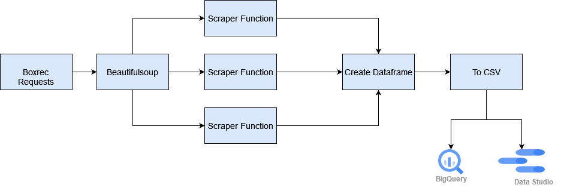

# Boxing Web Scrape Data

 

### Thanks to [Dylan Peterson](https://github.com/DyPeterson) for the title image.

 

### By Jarret Jeter

#### This project uses webscraping to extract the data of boxers from the international boxrec website such as the boxer's name, fight record, career length and location. Currently there are constraints on this process because the data is not easy to get access to. Use at your own risk! This could get your IP address banned from boxrec if sending too many GET requests and be careful about slowing their site down.
 

### Technologies Used

* beautifulsoup
* cloudscraper
* google bigquery
* google data studio
* pandas
* python

## Description

I'd just about given up this idea because of difficulty getting access and was going to use wikipedia instead, but decided to persevere. The project relies first and foremost on cloudscraper and Beautifulsoup to bypass a cloudflare firewall and parse data extracted from the search results of fighters on boxrec. Unfortunately I am unable to automate the search process currently because of the site's anti-bot technology, so I had to manually log in first and selectively choose which page at a time to scrape. After getting access, I create a soup object containing the entire page contents with Beautifulsoup to parse the table row html tags that hold the records I want. The specific data is then extracted by small functions that are called on by a larger function to create a dataframe out of the collected data. Afterwards there is some cleaning involved before writing to a csv file and loading into BigQuery. This was my first real effort at web scraping and it was difficult narrowing down what I wanted from the unstructured data.
 

## Setup/Installation Requirements

I won't go into too much detail here as far as getting access to the data goes. If you figure it out, cool.
 

You will need a boxrec account and a google cloud platform account for this

* First, make sure you have a text editor such as Visual Studio Code installed, a python3.7 virtual environment active, a linux bash terminal to use, and a boxrec account
* Clone this repository (https://github.com/jarretjeter/Boxing-Data.git) onto your local computer from github
* In VS Code or another text editor, open this project
* With your terminal, enter the command 'pip install -r requirements.txt' to get the necessary dependencies
* You will have to create environment variables saved to your boxrec username (BOXREC_USER) and password (BOXREC_PASSWORD)
* Go into the webscrape2.ipynb file. You need to first run the cell that obtains you user info with os.
* For the cells that use cloudscraper, you will need to manually perform a get request in your browser first and then copy your browser's headers and cookies information over into the cells for scraping access_
* Once you finally obtain the html content from the search, you can get the data running the cell that says Scrape Fighter Data
* After a dataframe is created, run the cell that says Write to csv (Initially just uncomment the line below 'Create new csv', you can append to it afterwards.).
* To run the last cell which loads to Google BigQuery, you will need an account on Google Cloud Platform and your own project to load to, as well as credentials set up on your local environment.

## Known Bugs

* This may be on the website's end, but after page 1 (or at least way down the line), the html content for the 'tr' tags returned to the IDE doesn't quite match that of the website's UI or html. So the extracted data is slightly off. The more pages extracted from, the more off the data...

## License
[MIT](https://github.com/jarretjeter/Boxing-Data/blob/main/LICENSE.txt)
 

If you have any questions, contact me at jarretjeter@gmail.com

_Copyright(c) 07/28/2022 Jarret Jeter_
